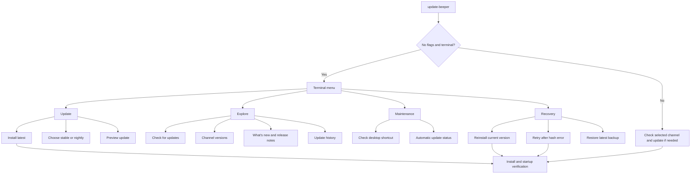
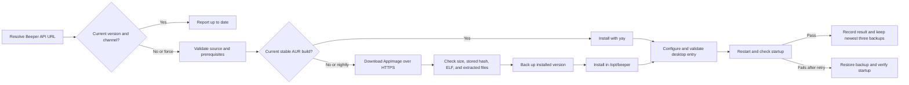

# update-beeper

An interactive terminal updater for Beeper Desktop on x86_64 Linux, built for Arch Linux and Wayland desktops. It checks Beeper's stable or nightly channel, installs the current AppImage, verifies the result, and keeps backups for recovery. A systemd user timer can run the same updater automatically.

> **Release status:** This README describes the unreleased v1.9.0 integration work. `master` download links install whatever is currently on `master`; they may not contain these features until v1.9.0 is published. To use a checkout, run its local `./install.sh`.

## Install and start

To use the v1.9.0 code while it is still under development, run the installer from a checkout of this branch:

```bash
cd /path/to/update-beeper
./install.sh
update-beeper                  # Open the terminal menu
```

The installer copies `update-beeper`, `beeper-version`, and `beeper-health` to `~/.local/bin`. Add that directory to `PATH` if needed. Running `./install.sh` from a checkout installs that checkout; the remote installer below fetches the currently published `master`:

```bash
curl -fsSL https://raw.githubusercontent.com/beeper-community/update-beeper/master/install.sh | bash
```

The updater writes Beeper under `/opt`, so it needs `sudo`. It accepts an already authorized or passwordless sudo session and otherwise prompts when run interactively. Review remote scripts before executing them if you prefer.

## Terminal options

With no flags in a terminal, `update-beeper` opens a menu. With no terminal, it checks for and installs an available update; this is how the timer runs. `--menu` opens the menu explicitly. The menu selects `fzf`, `dialog`, `whiptail`, or a built-in Bash interface, in that order. The Bash interface supports arrow keys, Enter, and `q`, and fits short terminals.



The menu also has **Help and flags** and **Exit**. Information actions do not install Beeper. Choosing a channel saves a preference; install it with **Install latest** or a later update command. Stable and nightly versions come from Beeper's download API. Nightly builds may be less stable. AUR is considered only for stable. The beta endpoint is not offered because it currently resolves to an unrelated, older build.

### Common commands

```bash
update-beeper --check             # Compare installed and selected channel
update-beeper --versions          # Installed, stable, nightly, and AUR status
update-beeper --branch            # Show selected channel
update-beeper --branch nightly    # Select nightly for future updates
update-beeper --branch stable     # Return to stable
update-beeper --dry-run           # Preview an available update
update-beeper --force             # Reinstall even when already current
update-beeper --rollback          # Restore the newest backup
update-beeper --automation-status # Timer, next check, and last result
```

### All updater flags

| Option | Purpose |
| --- | --- |
| `--check`, `-c` | Check without installing. |
| `--dry-run` | Preview source, method, channel, and backup location for an available update. |
| `--force`, `-f` | Reinstall even when the selected version is current. |
| `--branch [stable\|nightly]` | Show or save the selected channel. |
| `--versions` | Show installed and available versions, including AUR when known. |
| `--whats-new`, `-w` | Show changes since the installed version when notes are available. |
| `--changelog`, `-l` | Show cached notes in the terminal, or open Beeper's notes in a browser. |
| `--history` | Print local update history. |
| `--check-desktop` | Validate the shortcut, executable, version, and icon. |
| `--automation-status` | Show timer state, next check, and last service result. |
| `--rollback`, `-r` | Restore the newest backup and verify startup. |
| `--skip-checksum` | Bypass the stored hash comparison for this run. |
| `--quiet`, `-q` | Suppress routine output for automation. |
| `--notify`, `-n` | Send a desktop notification when supported. |
| `--menu`, `-m` | Open the terminal menu. |
| `--version`, `-v` | Print updater version. |
| `--help`, `-h` | Print help. |

`--skip-checksum` alone does not force an update. The menu's **Retry after hash error** action combines it with `--force`. If already current, use `--force --skip-checksum` for the same CLI behavior. Investigate a changed hash before bypassing the check.

## Update and recovery flow



On the direct path, the updater records the downloaded file's SHA256 on first use for each version and channel, then compares later downloads against that stored hash. **This is trust on first use, not a publisher signed checksum or independent authenticity guarantee.** It also checks the Beeper download domain, minimum size, executable type, required extracted files, installed version, permissions, and available disk space.

Current Beeper AppImages keep `package.json` inside `resources/app.asar`; the updater extracts that metadata before validation, so the `asar` command is required for those builds. It records the installed channel in `/opt/beeper/.update-beeper-branch` and keeps the newest three backups in `/opt/beeper-backups`. It checks startup for ten seconds. On failure, it clears Electron caches and retries; if recovery fails, it restores the previous backup and checks startup again. A successful restart confirms that Beeper survived this check, not that every in-app feature was tested.

When a direct install replaces an AUR-managed copy, the updater removes stale `beeper-v4-bin` tracking from pacman's database and marks Beeper's runtime dependencies as explicitly installed. This avoids a version mismatch between pacman and the files in `/opt`.

## Automatic updates

The included **user** service runs `~/.local/bin/update-beeper --quiet --notify`. Its timer runs daily after 10:00 with up to four hours of randomized delay and catches up after a missed run.

```bash
mkdir -p ~/.config/systemd/user
cp systemd/update-beeper-user.service ~/.config/systemd/user/update-beeper.service
cp systemd/update-beeper-user.timer ~/.config/systemd/user/update-beeper.timer
systemctl --user daemon-reload
systemctl --user enable --now update-beeper.timer
update-beeper --automation-status
```

Run these commands from a repository checkout. For a remote install, download the equivalent `master/systemd/update-beeper-user.service` and `.timer` files. The timer uses your selected channel. Background runs need sudo access that works without a terminal, such as an appropriate sudoers rule; they cannot answer a password prompt.

Inspect a run with `systemctl --user status update-beeper.service` or `journalctl --user -u update-beeper.service`. The repository also contains system service templates for manually managed setups; the user service is the normal desktop choice.

## Desktop and release notes

On Wayland, the updater creates `~/.local/share/applications/beeper-wayland.desktop`, installs an icon, applies native Wayland flags, and removes stale duplicate shortcuts. It uses an existing `~/bin/beeper-wayland` wrapper if present. `update-beeper --check-desktop` checks the shortcut without installing an update. Beeper restarts outside the updater's one-shot service so it remains running after the service exits.

`--changelog` uses a six-hour local cache of the [beeper-intel](https://github.com/robertogogoni/beeper-intel) feed when `jq` is available. `--whats-new` compares the installed version with the selected channel and shows any covered notes. That feed can lag behind Beeper's download API; the terminal identifies the latest version it covers and points to [Beeper's desktop changelog](https://www.beeper.com/changelog/desktop) for newer notes. If in-terminal data is unavailable, `--changelog` opens a browser when possible.

The older patch that suppressed Beeper's internal update prompt cannot currently be applied because its JavaScript is packed in `app.asar`. The updater reports that patch as skipped; it does not repack Beeper's application code.

## Files and requirements

| Path | Use |
| --- | --- |
| `~/.local/bin/update-beeper` | Installed updater. |
| `/opt/beeper/` | Current Beeper installation. |
| `/opt/beeper/.update-beeper-branch` | Installed channel marker. |
| `/opt/beeper-backups/` | Up to three recent installations for rollback. |
| `~/.config/update-beeper/config` | Selected channel. |
| `~/.cache/update-beeper/checksums.txt` | Stored first-use hashes. |
| `~/.cache/update-beeper/` | Release-notes cache. |
| `~/.local/share/update-beeper/update-beeper.log` | Event log. |
| `~/.local/share/update-beeper/update-history.log` | Update history. |
| `~/.local/share/applications/beeper-wayland.desktop` | User launcher. |
| `~/.local/share/icons/hicolor/512x512/apps/beepertexts.png` | Launcher icon. |
| `~/.config/BeeperTexts/` | Beeper user data and Electron caches. |

The updater requires Bash, x86_64 Linux, `curl`, `sudo`, and standard system utilities. Current AppImages also require `asar` for metadata extraction. Arch Linux or another pacman-based distribution is the supported package-management path; `yay` is needed only for a current AUR package. `fzf`, `dialog`, `whiptail`, `jq`, `notify-send`, and systemd user services add optional menu, notes, notification, and scheduling features. The direct-download path can run without pacman, but that configuration has less coverage.

## Troubleshooting

| Symptom | Action |
| --- | --- |
| `sudo` fails in a timer run | Check that `sudo -n true` succeeds for that user, then inspect the service journal. Interactive runs can prompt. |
| Stored checksum mismatch | Confirm the channel and URL, then use the menu retry or `--force --skip-checksum` if you accept the new file. |
| Desktop launcher or icon missing | Run `update-beeper --check-desktop`; `--force` recreates the launcher during reinstall. |
| Startup fails after install | Check the service journal and event log; try `--rollback` if a backup exists. |
| Release notes stop at an old version | Read [Beeper's current changelog](https://www.beeper.com/changelog/desktop); notes and version detection have separate sources. |

`beeper-version` is a separate quick status helper focused on stable. `beeper-health --desktop` delegates launcher validation to `update-beeper --check-desktop`; its process health mode is Hyprland-specific and expects an existing `~/bin/beeper-wayland` wrapper.

## Contributing

See [CONTRIBUTING.md](CONTRIBUTING.md), [CHANGELOG.md](CHANGELOG.md), and the [MIT license](LICENSE).
